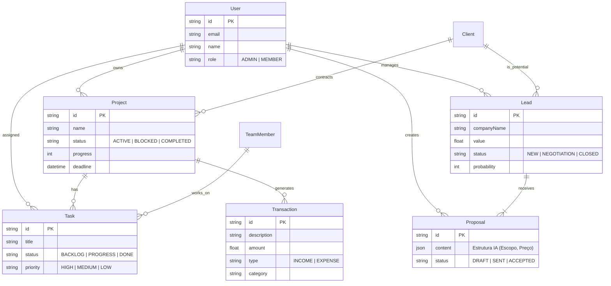

# Modelagem de Dados (Prisma ORM)

Este documento define a estrutura do banco de dados relacional necessária para suportar as funcionalidades do AgencyOS.

## 1. Diagrama Entidade-Relacionamento (Mermaid)



## 2. Prisma Schema (`schema.prisma`)

Abaixo está a representação técnica para implementação no Prisma ORM.

```prisma
datasource db {
  provider = "postgresql"
  url      = env("DATABASE_URL")
}

generator client {
  provider = "prisma-client-js"
}

enum Role {
  ADMIN
  MEMBER
  VIEWER
}

enum ProjectStatus {
  ACTIVE
  REVIEW
  COMPLETED
  BLOCKED
}

enum TaskStatus {
  BACKLOG
  PROGRESS
  DONE
}

enum TaskPriority {
  LOW
  MEDIUM
  HIGH
}

enum LeadStatus {
  NEW
  CONTACTED
  PROPOSAL
  NEGOTIATION
  CLOSED
  LOST
}

enum TransactionType {
  INCOME
  EXPENSE
}

model User {
  id        String   @id @default(cuid())
  email     String   @unique
  name      String?
  avatar    String?
  role      Role     @default(MEMBER)
  createdAt DateTime @default(now())
  updatedAt DateTime @updatedAt

  projects  Project[]
  tasks     Task[]
  leads     Lead[]
  proposals Proposal[]
}

model Client {
  id          String   @id @default(cuid())
  name        String
  companyName String?
  email       String?
  phone       String?
  
  projects    Project[]
  leads       Lead[]
}

model Project {
  id          String        @id @default(cuid())
  name        String
  description String?
  status      ProjectStatus @default(ACTIVE)
  progress    Int           @default(0)
  deadline    DateTime?
  thumbnail   String?
  
  clientId    String?
  client      Client?       @relation(fields: [clientId], references: [id])
  
  ownerId     String
  owner       User          @relation(fields: [ownerId], references: [id])
  
  tasks       Task[]
  transactions Transaction[]
  
  createdAt   DateTime      @default(now())
  updatedAt   DateTime      @updatedAt
}

model Task {
  id          String       @id @default(cuid())
  title       String
  description String?
  status      TaskStatus   @default(BACKLOG)
  priority    TaskPriority @default(MEDIUM)
  
  projectId   String?
  project     Project?     @relation(fields: [projectId], references: [id])
  
  assigneeId  String?
  assignee    User?        @relation(fields: [assigneeId], references: [id])
  
  createdAt   DateTime     @default(now())
  updatedAt   DateTime     @updatedAt
}

model Lead {
  id            String     @id @default(cuid())
  companyName   String
  contactPerson String
  value         Float
  status        LeadStatus @default(NEW)
  probability   Int        @default(0) // 0-100
  lastContact   DateTime   @default(now())
  
  managerId     String
  manager       User       @relation(fields: [managerId], references: [id])
  
  clientId      String?    // Se convertido em cliente
  client        Client?    @relation(fields: [clientId], references: [id])
  
  proposals     Proposal[]
  
  createdAt     DateTime   @default(now())
  updatedAt     DateTime   @updatedAt
}

model Proposal {
  id               String   @id @default(cuid())
  clientName       String
  executiveSummary String   @db.Text
  
  // Dados estruturados gerados pela IA (JSON)
  // Contém: teamStructure, options (prices), techStack
  aiData           Json     
  
  leadId           String?
  lead             Lead?    @relation(fields: [leadId], references: [id])
  
  creatorId        String
  creator          User     @relation(fields: [creatorId], references: [id])
  
  createdAt        DateTime @default(now())
}

model Transaction {
  id          String          @id @default(cuid())
  description String
  amount      Float
  type        TransactionType
  status      String          @default("PENDING") // PAID, PENDING, OVERDUE
  date        DateTime
  category    String
  
  projectId   String?
  project     Project?        @relation(fields: [projectId], references: [id])
  
  createdAt   DateTime        @default(now())
}
```
